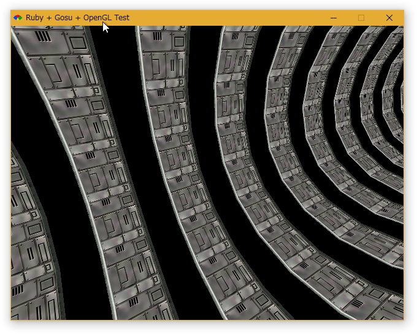

<!-- -*- encoding: utf-8 -*- -->

Ruby + gosu + opengl sample
===========================

動作に必要なパッケージ
----------------------

Ruby + gosu で OpenGL を動かすためには、opengl をインストールしないといけない。

```bash
gem install gosu
gem install opengl
gem install glu
gem install glut
```

* [larskanis/opengl](https://github.com/larskanis/opengl)

opengl-bindings を使う選択肢もある。

```bash
gem install opengl-bindings
```

* [vaiorabbit/ruby-opengl](https://github.com/vaiorabbit/ruby-opengl)

ただし、opengl を使った場合とは一部書き方が異なる。
また、Windows上で glut や glfw を使う場合は、freeglut.dll と glfw3.dll が必要になる。

* [GLFW - Download](https://www.glfw.org/download.html)
* [freeglut Windows Development Libraries](https://www.transmissionzero.co.uk/software/freeglut-devel/)

動作確認環境
------------

* Windows10 x64
  * Ruby 2.4.5 p335 mingw32 + gosu 0.14.5 + opengl 0.10.0 + glu 8.3.0 + glut 8.3.0
  * Ruby 2.5.3 p105 mingw32 + gosu 0.14.5 + opengl-bindings 1.6.8

* Ubuntu 18.04 LTS
  * Ruby 2.4.5 p335 + gosu 0.14.5 + opengl 0.10.0 + glu 8.3.0 + glut 8.3.0
  * Ruby 2.5.1 p57 + gosu 0.14.5 + opengl-bindings 1.6.8

opengl.rb は修正が必要
----------------------

* [larskanis/opengl: The official repository of the ruby-opengl wrapper](https://github.com/larskanis/opengl)
* [invalid operation for glEnd - Issue #18 - larskanis/opengl](https://github.com/larskanis/opengl/issues/18)

opengl.rb は Windows上で動作させると一部でバグる。修正が必要。

opengl.rb を開く。

```
[Ruby install folder]\lib\ruby\gems\2.?.0\gems\opengl-*-x86-mingw32\lib\opengl.rb
```

implementation.send の前や後ろに、begin/rescue を挿入。

```ruby
define_singleton_method(mn) do |*args,&block|
  begin
    implementation.send(mn, *args, &block)
  rescue
  end
end
define_method(mn) do |*args,&block|
  begin
   implementation.send(mn, *args, &block)
  rescue
  end
end
```

Screenshot
----------

```bash
ruby 01_gosu_opengl_11.rb
```


* * *

```bash
ruby 16_gosu_opengl_test1.rb
```


* * *

```bash
ruby 17_gosu_opengl_test2.rb
```



* * *

```bash
ruby 18_gosu_opengl_test3.rb
```


* * *

```bash
ruby opengl_glut_only_test.rb
```


